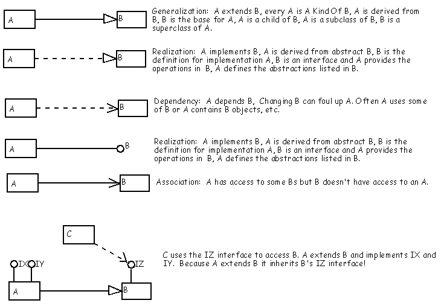

# UML

## TOC

- [UML](#uml)
  - [Requirement Specification](#requirement-specification)
  - [Use case](#use-case)
  - [Acitivity Diagram](#activity-diagram)
  - [Sequence Diagram](#sequence-diagram)
  - [Class Diagram](#class-diagram)

## UML

### Requirement Specification

- Who is specifying it
- For Whom this is being specified
- What is specified.

### Use case

What the system does for a user.

- **Scenario**:
  - A patient calls the clinic to make an appointment for a yearly checkup.
  - The receptionist finds the nearest empty slot in the appointment book and schedules the appointment in that time slot.
    
    

#### Constructing Use Case

- Collect information sources - How Am I supposed to know that?
- Identify potential actors - Which partners and customers use the goods and services of the business system
- Identify potential business use cases - Which goods and services actor can draw upon?
- Connect business use cases - Who can make use of what goods and services of the business system?
- Describe Actors - Who or what do the actors represent?
- Search for more business use cases - what else needs to be done?
- Edit Business use cases - what actually has to be included in a business use case?
- Document business use cases - What happens in a business use case?
- Model Relationships between business use cases - What activities are conducted repeatedly?
- Verify the view - Is everything correct?

### Activity Diagram

#### Constructing activity diagrams in the external view

- collect information sources - how am i supposed to know that?
- find activities and actions - what has to be done when actors draw upon offered goods and services?
- adopt actors from business use cases - who is responsible for each action?
- connect actions - in which order are actions processed?
- refine activitiess - do any other activity diagrams have to be added?
- verify the view - is everything correct?

### Sequence Diagrams

#### Constructing Sequence Diagram

- Designate actors and business system—Who is taking part?
- Designate initiators—Who starts interactions?
- Describe the message exchange between actors and business system—Which messages are being exchanged?
- Identify the course of interactions—What is the order?
- Insert additional information—What else is important?
- Verify the view—Is everything correct?

### Class Diagram

**Association** - a relationship between instances of the two classes. There is an association between two classes if an instance of one class must know about the other in order to perform its work. In a diagram, an association is a link connecting two classes.

**Aggregation** - an association in which one class belongs to a collection. An aggregation has a diamond end pointing to the part containing the whole. In our diagram, Order has a collection of OrderDetails.

**Generalization** - an inheritance link indicating one class is a superclass of the other. A generalization has a triangle pointing to the superclass. Payment is a superclass of Cash, Check, and Credit.

An association has two ends. An end may have a role name to clarify the nature of the association. For example, an OrderDetail is a line item of each Order.

A **navigability** arrow on an association shows which direction the association can be traversed or queried. An OrderDetail can be queried about its Item, but not the other way around. The arrow also lets you know who "owns" the association's implementation; in this case, OrderDetail has an Item. Associations with no navigability arrows are bi-directional.

The **multiplicity** of an association end is the number of possible instances of the class associated with a single instance of the other end. Multiplicities are single numbers or ranges of numbers. In our example, there can be only one Customer for each Order, but a Customer can have any number of Orders.

- `0..1` -> zero or one instance. The notation `n..m` indicates `n to m` instances.
- `0..* or *` -> no limit on the number of instances (including none).
- `1` -> exactly one instance
- `1..*` -> at least one instance

#### Class Diagram Concepts

#### Uml Arrow Signs

